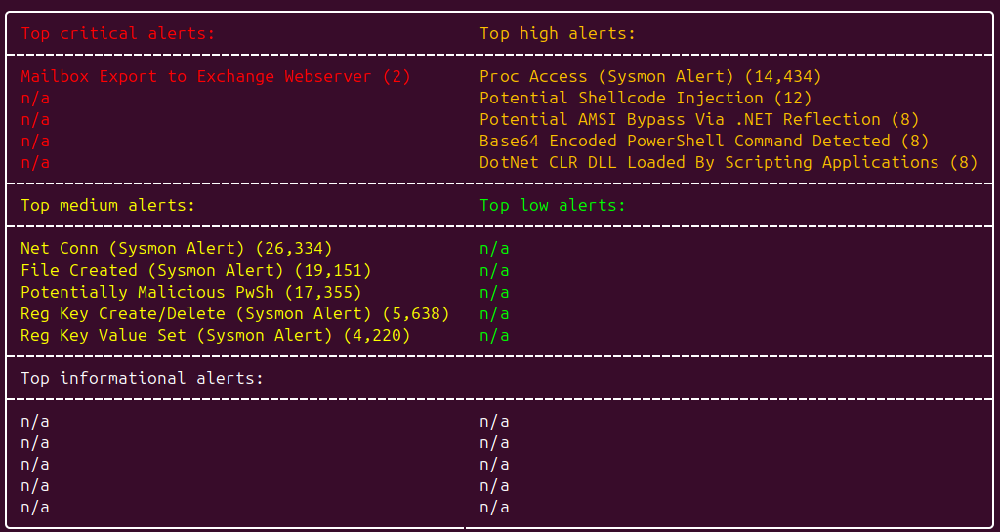
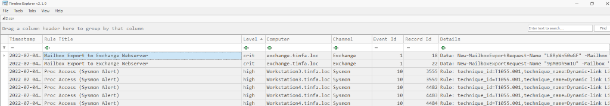
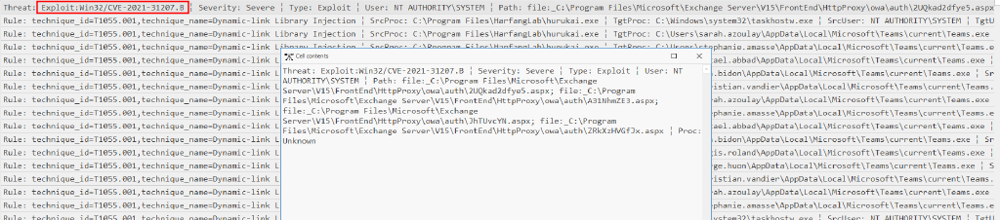
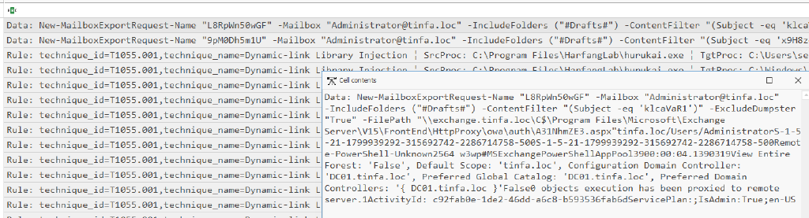

# SOC Simulator 1/5 - Vecteur initial

```
Durant l’été 2022, un opérateur d’importance vitale (OIV) alerte l’ANSSI car il pense être victime d’une cyberattaque d’ampleur. Le security operation center (SOC) de l’OIV envoie à l’ANSSI un export de sa collecte système des derniers jours. Vous êtes chargé de comprendre les actions réalisées par l’attaquant.

Note : Les 5 parties sont numérotées dans l’ordre chronologique de l’attaque mais il n’est pas nécessaire de les résoudre dans l’ordre.

Fichiers : 
soc_events.zip

Retrouver le nom de la vulnérabilité et l’heure UTC de la première tentative d’exploitation de cette vulnérabilité.

Format du flag (insensible à la casse): FCSC{EternalBlue|2021-11-27T17:38}
```

On dispose d’une archive intitulée soc_events.zip, contenant un ensemble conséquent de fichiers au format .evtx. Ces fichiers correspondent aux journaux d’événements Windows.

```
ls *.evtx | wc -l
450
```

Afin de faciliter l’analyse des fichiers .evtx, on a recours à l’outil Hayabusa. Cet outil est conçu pour parser les journaux d’événements Windows et permet de générer une timeline structurée, tout en appliquant des règles SIGMA pour identifier des comportements potentiellement malveillants ou suspects.

L’objectif de cette étape est double :

- Organiser les événements de manière chronologique afin d’établir une séquence précise des actions réalisées sur le système.

- Prioriser l’analyse en mettant en évidence les événements les plus critiques, à l’aide du moteur de détection basé sur les règles SIGMA.

Dans un second temps, les événements extraits ont été triés par date, en se basant sur le nom des fichiers au format YYYYMMDDThhmmss.evtx (ex. 20220704T172606.evtx). Ce format facilite un classement chronologique rapide et fiable. Chaque groupe d’événements a ensuite été exporté au format CSV avec la commande suivante d'Hayabusa : 

`hayabusa-3.2.0-lin-x64-gnu csv-timeline --enable-all-rules -d ./soc_event_20220706/ -o events_hayabusa_20220706.csv`

Pour la phase d’exploration, on utilise TimelineExplorer, un outil développé par Eric Zimmerman. Cet utilitaire permet de charger des fichiers CSV ou Excel, et de manipuler les données à travers des filtres dynamiques appliqués aux colonnes.
On concentre alors notre attention sur les événements identifiés comme critiques. Toutefois, il convient de noter que la détection de ces événements repose sur l’ensemble de règles SIGMA utilisé. Voici un exemple de résultats proposé par l'outil Hayabusa concernant les événèments du 2022-07-04 : 



L’analyse préliminaire fait ressortir plusieurs alertes critiques particulièrement dignes d’intérêt. On procède à présent à une revue détaillée des événements critiques à l’aide de TimelineExplorer. Ci-dessous les évènements critiques du 04/07 :  



Les alertes critiques identifiées pour les journées du 5 et 6 juillet 2022 présentent des similarités marquées, tant en termes de contenu que de timestamp, ce qui suggère fortement qu’elles ont été générées par un mécanisme automatisé, tel qu’un agent de sécurité ou un processus de surveillance centralisé.



On porte donc attention à la mention de la `CVE-2021-31207`, référencée dans ces événements. On va ainsi approfondir notre investigation afin de comprendre le rôle éventuel de cette vulnérabilité dans l’activité observée, et déterminer si une exploitation effective a pu avoir lieu. Une recherche rapide sur la `CVE-2021-31207` mène à un [article technique](https://cloud.google.com/blog/topics/threat-intelligence/pst-want-shell-proxyshell-exploiting-microsoft-exchange-servers?hl=en) décrivant son exploitation. 

Voici la payload générique connue : 

`New-MailBoxExportRequest – Mailbox john.doe@enterprise.corp -FilePath \\127.0.0.1\C$\path\to\webshell.asp`

En croisant les informations, on retrouve exactement la même payload dans les détails des évènements critiques du 04/07 (présenté plus haut) que celle présentée dans l’article. Cela confirme qu’un exploit connu de cette vulnérabilité a bien été utilisé sur la machine.



Les attaquants ont donc exploité la vulnérabilité ProxyShell le `2022-07-04 à 15:36:43`.

`Flag : FCSC{ProxyShell|2022-07-04T15:36}`

Rédigé par `Asta - Imineti By Niji`
